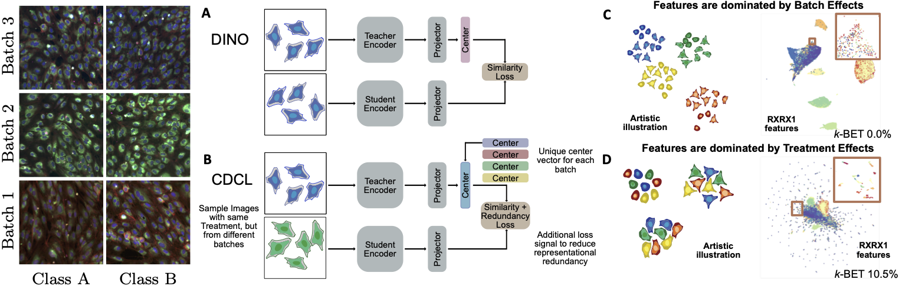

# [Metadata-guided Consistency Learning for High Content Images](https://arxiv.org/abs/2212.11595)

***Originally published at MIDL-2023***

High content imaging assays can capture rich phenotypic response data for large sets of compound treatments, aiding in the characterization and discovery of novel drugs. However, extracting representative features from high content images that can capture subtle nuances in phenotypes remains challenging. The lack of high-quality labels makes it difficult to achieve satisfactory results with supervised deep learning. Self-Supervised learning methods, which learn from automatically generated labels has shown great success on natural images, offer an attractive alternative also to microscopy images. However, we find that self-supervised learning techniques underperform on high content imaging assays. One challenge is the undesirable domain shifts present in the data known as batch effects, which may be caused by biological noise or uncontrolled experimental conditions. To this end, we introduce Cross-Domain Consistency Learning (CDCL), a novel approach that is able to learn in the presence of batch effects. CDCL enforces the learning of biological similarities while disregarding undesirable batch-specific signals, which leads to more useful and versatile representations. These features are organised according to their morphological changes and are more useful for downstream tasks - such as distinguishing treatments and mode of action. 

### *Our approach*

<p align="center">
  
</p>

In high content screening data, each image (left) contains two dominating signals. The first is related to the treatment and its biological effect. The other is comprised of confounding factors, *i*.*e*. batch effects. (A) DINO results in features dominated by batch effects (C). (B) depict CDCL and the resulting feature embeddings (D) which correctly capture treatment effects and ignore batch effects. Right panels are colored by batch, zoomed area is colored by treatment.

## Enviroment setup
To build using the docker file use the following command \
```docker build -f Dockerfile -t med_trans \``` \
```              --build-arg UID=$(id -u) \``` \
```              --build-arg GID=$(id -g) \``` \
```              --build-arg USER=$(whoami) \``` \
```              --build-arg GROUP=$(id -g -n) .```

## Datasets

The datasets can be downloaded from their respective sources: 

[RxRx1](https://www.rxrx.ai/rxrx1)

[CPG0004](https://github.com/broadinstitute/cellpainting-gallery)

The datasets are build using the functionality in ```build_data/```


## Usage:
* Training: ```python classification.py```
* Training with DINO: ```python classification.py --dino```
* Testing (using json file): ```python classification.py --test```
* Testing (using saved checkpoint): ```python classification.py --checkpoint CheckpointName --test```

## Run RxRx1
```python classification.py --params_path run_settings/RXRX1-supervised.json --split_number=1``` \
```python classification.py --params_path run_settings/RXRX1-DINO.json --dino --split_number=1``` \
```python classification.py --params_path run_settings/RXRX1-BYOL.json --byol --split_number=1``` \
```python classification.py --params_path run_settings/RXRX1-DINO-CB.json --dino --split_number=1``` \
```python classification.py --params_path run_settings/RXRX1-BYOL-CB.json --byol --split_number=1``` \
```python classification.py --params_path run_settings/RXRX1-CDCL.json --dino --split_number=1``` 


## Run RxRx1 subsets

```subset_strategy=["only_controls", "only_treatments", "only_treatments_half_as_many_with_controls"]```

```python classification.py --params_path run_settings/RXRX1-CDCL-subset.json --dino --subset_strategy "only_controls" --split_number=1```

```python classification.py --params_path run_settings/RXRX1-supervised-subset.json --subset_strategy "only_controls" --split_number=1```


## Run CPG0004

```python classification.py --params_path run_settings/CPG0004-CDCL.json --dino --split_number=1```

```python classification.py --params_path run_settings/CPG0004-supervised.json --split_number=1```


## Results

The results can be gathered from the results.json file found at the specified output path of the model (defined either in the primary run json file or the one used with the --test flag). 
This file contains all results except Grit and kbet, which can be generated using the grit_and_kbet.ipynb notebook in the eval_notebooks folder.
